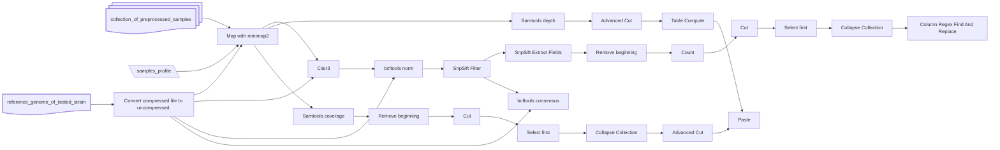

# Workflow diagrams

## Allele-based Pathogen Identification

```mermaid
graph LR
0["collection_of_preprocessed_samples"]@{ shape: docs }
1["samples_profile"]@{ shape: lean-l }
2["reference_genome_of_tested_strain"]@{ shape: doc }
3["Convert compressed file to uncompressed."]@{ shape: process }
2 --> 3
4["Map with minimap2"]@{ shape: process }
1 --> 4
0 --> 4
3 --> 4
5["Clair3"]@{ shape: process }
4 --> 5
3 --> 5
6["Samtools depth"]@{ shape: process }
4 --> 6
7["Samtools coverage"]@{ shape: process }
4 --> 7
8["bcftools norm"]@{ shape: process }
5 --> 8
3 --> 8
9["Advanced Cut"]@{ shape: process }
6 --> 9
10["Remove beginning"]@{ shape: process }
7 --> 10
11["SnpSift Filter"]@{ shape: process }
8 --> 11
12["Table Compute"]@{ shape: process }
9 --> 12
13["Cut"]@{ shape: process }
10 --> 13
14["SnpSift Extract Fields"]@{ shape: process }
11 --> 14
15["bcftools consensus"]@{ shape: process }
11 --> 15
3 --> 15
16["Select first"]@{ shape: process }
13 --> 16
17["Remove beginning"]@{ shape: process }
14 --> 17
18["Collapse Collection"]@{ shape: process }
16 --> 18
19["Count"]@{ shape: process }
17 --> 19
20["Advanced Cut"]@{ shape: process }
18 --> 20
21["Cut"]@{ shape: process }
19 --> 21
22["Paste"]@{ shape: process }
20 --> 22
12 --> 22
23["Select first"]@{ shape: process }
21 --> 23
24["Collapse Collection"]@{ shape: process }
23 --> 24
25["Column Regex Find And Replace"]@{ shape: process }
24 --> 25
```
