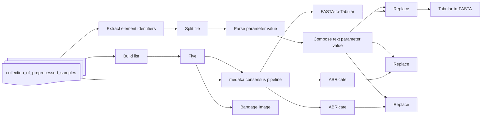

# Workflow diagrams

## Gene-based Pathogen Identification

```mermaid
graph LR
0["collection_of_preprocessed_samples"]@{ shape: docs }
1["Extract element identifiers"]@{ shape: process }
0 --> 1
2["Build list"]@{ shape: process }
0 --> 2
3["Split file"]@{ shape: process }
1 --> 3
4["Flye"]@{ shape: process }
2 --> 4
5["Parse parameter value"]@{ shape: process }
3 --> 5
6["medaka consensus pipeline"]@{ shape: process }
4 --> 6
0 --> 6
7["Bandage Image"]@{ shape: process }
4 --> 7
8["Compose text parameter value"]@{ shape: process }
5 --> 8
9["FASTA-to-Tabular"]@{ shape: process }
6 --> 9
10["ABRicate"]@{ shape: process }
6 --> 10
11["ABRicate"]@{ shape: process }
6 --> 11
12["Replace"]@{ shape: process }
8 --> 12
9 --> 12
13["Replace"]@{ shape: process }
8 --> 13
10 --> 13
14["Replace"]@{ shape: process }
8 --> 14
11 --> 14
15["Tabular-to-FASTA"]@{ shape: process }
12 --> 15
```
