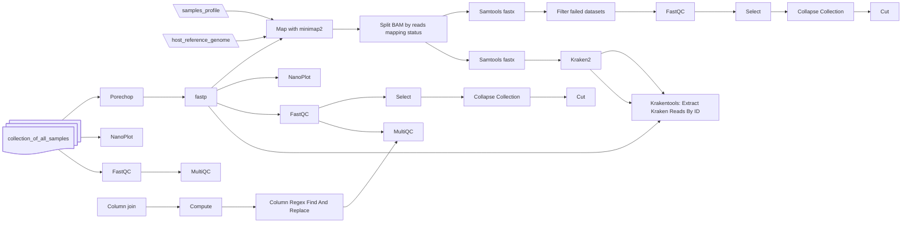

# Workflow diagrams

## Nanopore Preprocessing

```mermaid
graph LR
0["samples_profile"]@{ shape: lean-l }
1["host_reference_genome"]@{ shape: lean-l }
2["collection_of_all_samples"]@{ shape: docs }
3["Porechop"]@{ shape: process }
2 --> 3
4["NanoPlot"]@{ shape: process }
2 --> 4
5["FastQC"]@{ shape: process }
2 --> 5
6["fastp"]@{ shape: process }
3 --> 6
7["MultiQC"]@{ shape: process }
5 --> 7
8["Map with minimap2"]@{ shape: process }
0 --> 8
6 --> 8
1 --> 8
9["NanoPlot"]@{ shape: process }
6 --> 9
10["FastQC"]@{ shape: process }
6 --> 10
11["Split BAM by reads mapping status"]@{ shape: process }
8 --> 11
12["Select"]@{ shape: process }
10 --> 12
13["Samtools fastx"]@{ shape: process }
11 --> 13
14["Samtools fastx"]@{ shape: process }
11 --> 14
15["Collapse Collection"]@{ shape: process }
12 --> 15
16["Filter failed datasets"]@{ shape: process }
13 --> 16
17["Kraken2"]@{ shape: process }
14 --> 17
18["Cut"]@{ shape: process }
15 --> 18
19["FastQC"]@{ shape: process }
16 --> 19
20["Krakentools: Extract Kraken Reads By ID"]@{ shape: process }
6 --> 20
17 --> 20
17 --> 20
21["Select"]@{ shape: process }
19 --> 21
22["Collapse Collection"]@{ shape: process }
21 --> 22
23["Cut"]@{ shape: process }
22 --> 23
24["Column join"]@{ shape: process }
25["Compute"]@{ shape: process }
24 --> 25
26["Column Regex Find And Replace"]@{ shape: process }
25 --> 26
27["MultiQC"]@{ shape: process }
10 --> 27
26 --> 27
```
