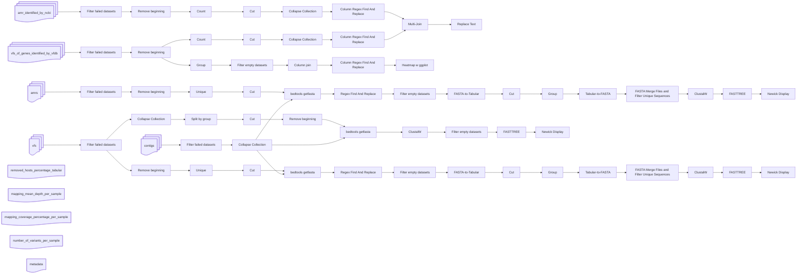

# Workflow diagrams

## Pathogen Detection PathoGFAIR Samples Aggregation and Visualisation

```mermaid
graph LR
0["amr_identified_by_ncbi"]@{ shape: docs }
1["vfs_of_genes_identified_by_vfdb"]@{ shape: docs }
2["amrs"]@{ shape: docs }
3["contigs"]@{ shape: docs }
4["vfs"]@{ shape: docs }
5["removed_hosts_percentage_tabular"]@{ shape: doc }
6["mapping_mean_depth_per_sample"]@{ shape: doc }
7["mapping_coverage_percentage_per_sample"]@{ shape: doc }
8["number_of_variants_per_sample"]@{ shape: doc }
9["metadata"]@{ shape: doc }
10["Filter failed datasets"]@{ shape: process }
0 --> 10
11["Filter failed datasets"]@{ shape: process }
1 --> 11
12["Filter failed datasets"]@{ shape: process }
2 --> 12
13["Filter failed datasets"]@{ shape: process }
3 --> 13
14["Filter failed datasets"]@{ shape: process }
4 --> 14
15["Remove beginning"]@{ shape: process }
10 --> 15
16["Remove beginning"]@{ shape: process }
11 --> 16
17["Remove beginning"]@{ shape: process }
12 --> 17
18["Collapse Collection"]@{ shape: process }
13 --> 18
19["Collapse Collection"]@{ shape: process }
14 --> 19
20["Remove beginning"]@{ shape: process }
14 --> 20
21["Count"]@{ shape: process }
15 --> 21
22["Count"]@{ shape: process }
16 --> 22
23["Group"]@{ shape: process }
16 --> 23
24["Unique"]@{ shape: process }
17 --> 24
25["Split by group"]@{ shape: process }
19 --> 25
26["Unique"]@{ shape: process }
20 --> 26
27["Cut"]@{ shape: process }
21 --> 27
28["Cut"]@{ shape: process }
22 --> 28
29["Filter empty datasets"]@{ shape: process }
23 --> 29
30["Cut"]@{ shape: process }
24 --> 30
31["Cut"]@{ shape: process }
25 --> 31
32["Cut"]@{ shape: process }
26 --> 32
33["Collapse Collection"]@{ shape: process }
27 --> 33
34["Collapse Collection"]@{ shape: process }
28 --> 34
35["Column join"]@{ shape: process }
29 --> 35
36["bedtools getfasta"]@{ shape: process }
18 --> 36
30 --> 36
37["Remove beginning"]@{ shape: process }
31 --> 37
38["bedtools getfasta"]@{ shape: process }
18 --> 38
32 --> 38
39["Column Regex Find And Replace"]@{ shape: process }
33 --> 39
40["Column Regex Find And Replace"]@{ shape: process }
34 --> 40
41["Column Regex Find And Replace"]@{ shape: process }
35 --> 41
42["Regex Find And Replace"]@{ shape: process }
36 --> 42
43["bedtools getfasta"]@{ shape: process }
18 --> 43
37 --> 43
44["Regex Find And Replace"]@{ shape: process }
38 --> 44
45["Multi-Join"]@{ shape: process }
40 --> 45
39 --> 45
46["Heatmap w ggplot"]@{ shape: process }
41 --> 46
47["Filter empty datasets"]@{ shape: process }
42 --> 47
48["ClustalW"]@{ shape: process }
43 --> 48
49["Filter empty datasets"]@{ shape: process }
44 --> 49
50["Replace Text"]@{ shape: process }
45 --> 50
51["FASTA-to-Tabular"]@{ shape: process }
47 --> 51
52["Filter empty datasets"]@{ shape: process }
48 --> 52
53["FASTA-to-Tabular"]@{ shape: process }
49 --> 53
54["Cut"]@{ shape: process }
51 --> 54
55["FASTTREE"]@{ shape: process }
52 --> 55
56["Cut"]@{ shape: process }
53 --> 56
57["Group"]@{ shape: process }
54 --> 57
58["Newick Display"]@{ shape: process }
55 --> 58
59["Group"]@{ shape: process }
56 --> 59
60["Tabular-to-FASTA"]@{ shape: process }
57 --> 60
61["Tabular-to-FASTA"]@{ shape: process }
59 --> 61
62["FASTA Merge Files and Filter Unique Sequences"]@{ shape: process }
60 --> 62
63["FASTA Merge Files and Filter Unique Sequences"]@{ shape: process }
61 --> 63
64["ClustalW"]@{ shape: process }
62 --> 64
65["ClustalW"]@{ shape: process }
63 --> 65
66["FASTTREE"]@{ shape: process }
64 --> 66
67["FASTTREE"]@{ shape: process }
65 --> 67
68["Newick Display"]@{ shape: process }
66 --> 68
69["Newick Display"]@{ shape: process }
67 --> 69
```
