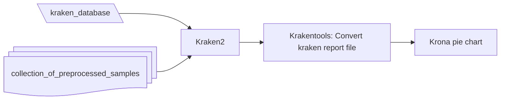

# Workflow diagrams

## Taxonomy Profiling and Visualization with Krona

```mermaid
graph LR
0["collection_of_preprocessed_samples"]@{ shape: docs }
1["kraken_database"]@{ shape: lean-l }
2["Kraken2"]@{ shape: process }
1 --> 2
0 --> 2
3["Krakentools: Convert kraken report file"]@{ shape: process }
2 --> 3
4["Krona pie chart"]@{ shape: process }
3 --> 4
```
