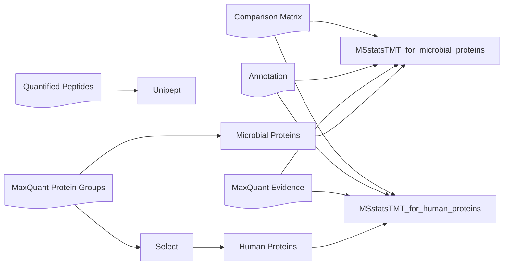

# Workflow diagrams

## Clinical Metaproteomics Data Interpretation

```mermaid
graph LR
0["Quantified Peptides"]@{ shape: doc }
1["MaxQuant Protein Groups"]@{ shape: doc }
2["MaxQuant Evidence"]@{ shape: doc }
3["Annotation"]@{ shape: doc }
4["Comparison Matrix"]@{ shape: doc }
5["Unipept"]@{ shape: process }
0 --> 5
6["Microbial Proteins"]@{ shape: process }
1 --> 6
7["Select"]@{ shape: process }
1 --> 7
8["MSstatsTMT_for_microbial_proteins"]@{ shape: process }
4 --> 8
3 --> 8
2 --> 8
6 --> 8
9["Human Proteins"]@{ shape: process }
7 --> 9
10["MSstatsTMT_for_human_proteins"]@{ shape: process }
4 --> 10
3 --> 10
2 --> 10
9 --> 10
```
