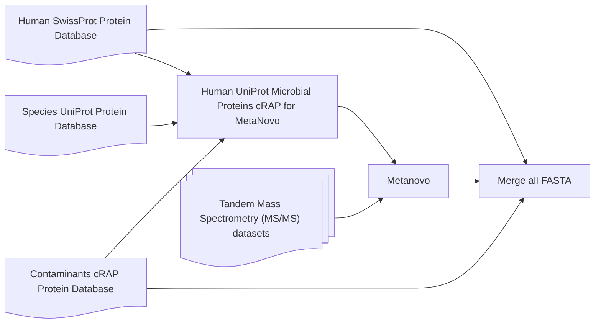

# Workflow diagrams

## Generate a Clinical Metaproteomics Database

```mermaid
graph LR
0["Human SwissProt Protein Database"]@{ shape: doc }
1["Tandem Mass Spectrometry (MS/MS) datasets"]@{ shape: docs }
2["Species UniProt Protein Database"]@{ shape: doc }
3["Contaminants cRAP Protein Database"]@{ shape: doc }
4["Human UniProt Microbial Proteins cRAP for MetaNovo"]@{ shape: process }
0 --> 4
2 --> 4
3 --> 4
5["Metanovo"]@{ shape: process }
4 --> 5
1 --> 5
6["Merge all FASTA"]@{ shape: process }
0 --> 6
5 --> 6
3 --> 6
```
