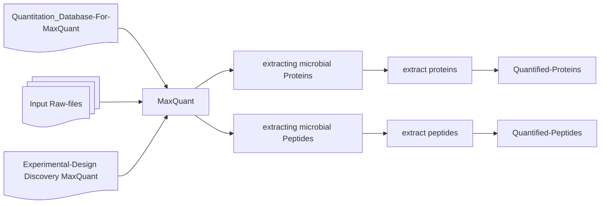

# Workflow diagrams

## Clinical Metaproteomics Quantitation

```mermaid
graph LR
0["Quantitation_Database-For-MaxQuant"]@{ shape: doc }
1["Experimental-Design Discovery MaxQuant"]@{ shape: doc }
2["Input Raw-files"]@{ shape: docs }
3["MaxQuant"]@{ shape: process }
0 --> 3
2 --> 3
1 --> 3
4["extracting microbial Proteins"]@{ shape: process }
3 --> 4
5["extracting microbial Peptides"]@{ shape: process }
3 --> 5
6["extract proteins"]@{ shape: process }
4 --> 6
7["extract peptides"]@{ shape: process }
5 --> 7
8["Quantified-Proteins"]@{ shape: process }
6 --> 8
9["Quantified-Peptides"]@{ shape: process }
7 --> 9
```
