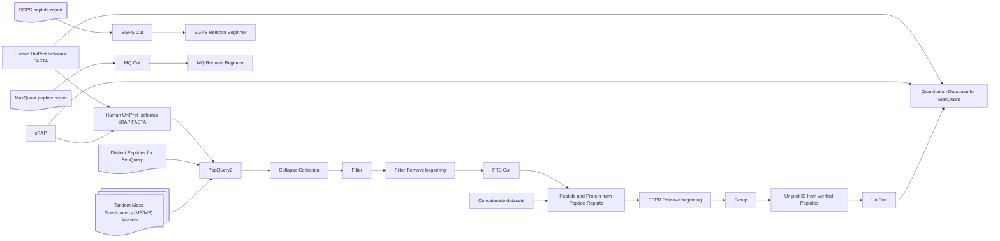

# Workflow diagrams

## Clinical Metaproteomics Verification Workflow

```mermaid
graph LR
0["Human UniProt Isoforms FASTA"]@{ shape: process }
1["cRAP"]@{ shape: process }
2["Tandem Mass Spectrometry (MS/MS) datasets"]@{ shape: docs }
3["SGPS peptide report"]@{ shape: doc }
4["Distinct Peptides for PepQuery"]@{ shape: doc }
5["MaxQuant peptide report"]@{ shape: doc }
6["Human UniProt Isoforms cRAP FASTA"]@{ shape: process }
0 --> 6
1 --> 6
7["SGPS Cut"]@{ shape: process }
3 --> 7
8["MQ Cut"]@{ shape: process }
5 --> 8
9["PepQuery2"]@{ shape: process }
6 --> 9
4 --> 9
2 --> 9
10["SGPS Remove Beginner"]@{ shape: process }
7 --> 10
11["MQ Remove Beginner"]@{ shape: process }
8 --> 11
12["Collapse Collection"]@{ shape: process }
9 --> 12
13["Concatenate datasets"]@{ shape: process }
14["Filter"]@{ shape: process }
12 --> 14
15["Filter Remove beginning"]@{ shape: process }
14 --> 15
16["FRB Cut"]@{ shape: process }
15 --> 16
17["Peptide and Protein from Peptide Reports"]@{ shape: process }
16 --> 17
13 --> 17
18["PPPR Remove beginning"]@{ shape: process }
17 --> 18
19["Group"]@{ shape: process }
18 --> 19
20["Uniprot ID from verified Peptides"]@{ shape: process }
19 --> 20
21["UniProt"]@{ shape: process }
20 --> 21
22["Quantitation Database for MaxQuant"]@{ shape: process }
0 --> 22
1 --> 22
21 --> 22
```
