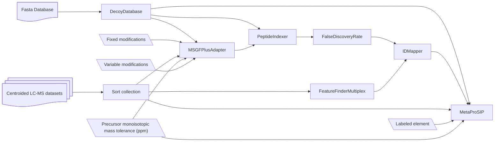

# Workflow diagrams

## MetaProSIP OpenMS 2.8

```mermaid
graph LR
0["Centroided LC-MS datasets"]@{ shape: docs }
1["Fasta Database"]@{ shape: doc }
2["Precursor monoisotopic mass tolerance (ppm)"]@{ shape: lean-l }
3["Fixed modifications"]@{ shape: lean-l }
4["Variable modifications"]@{ shape: lean-l }
5["Labeled element"]@{ shape: lean-l }
6["Sort collection"]@{ shape: process }
0 --> 6
7["DecoyDatabase"]@{ shape: process }
1 --> 7
8["FeatureFinderMultiplex"]@{ shape: process }
6 --> 8
9["MSGFPlusAdapter"]@{ shape: process }
7 --> 9
3 --> 9
6 --> 9
2 --> 9
4 --> 9
10["PeptideIndexer"]@{ shape: process }
7 --> 10
9 --> 10
11["FalseDiscoveryRate"]@{ shape: process }
10 --> 11
12["IDMapper"]@{ shape: process }
11 --> 12
8 --> 12
13["MetaProSIP"]@{ shape: process }
7 --> 13
12 --> 13
6 --> 13
5 --> 13
2 --> 13
```
