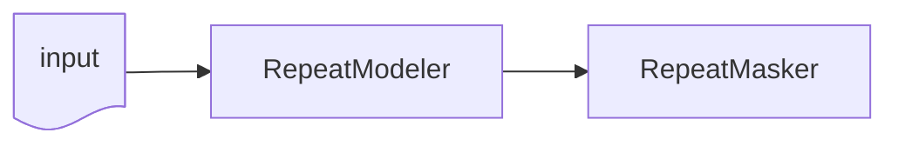

# Workflow diagrams

## Repeat masking with RepeatModeler and RepeatMasker

```mermaid
graph LR
0["input"]@{ shape: doc }
1["RepeatModeler"]@{ shape: process }
0 --> 1
2["RepeatMasker"]@{ shape: process }
1 --> 2
```
