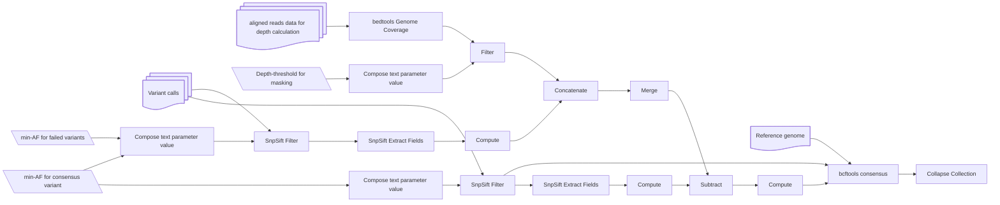

# Workflow diagrams

## COVID-19: consensus construction

```mermaid
graph LR
0["Variant calls"]@{ shape: docs }
1["min-AF for consensus variant"]@{ shape: lean-l }
2["min-AF for failed variants"]@{ shape: lean-l }
3["aligned reads data for depth calculation"]@{ shape: docs }
4["Depth-threshold for masking"]@{ shape: lean-l }
5["Reference genome"]@{ shape: doc }
6["Compose text parameter value"]@{ shape: process }
1 --> 6
7["Compose text parameter value"]@{ shape: process }
2 --> 7
1 --> 7
8["bedtools Genome Coverage"]@{ shape: process }
3 --> 8
9["Compose text parameter value"]@{ shape: process }
4 --> 9
10["SnpSift Filter"]@{ shape: process }
6 --> 10
0 --> 10
11["SnpSift Filter"]@{ shape: process }
7 --> 11
0 --> 11
12["Filter"]@{ shape: process }
9 --> 12
8 --> 12
13["SnpSift Extract Fields"]@{ shape: process }
10 --> 13
14["SnpSift Extract Fields"]@{ shape: process }
11 --> 14
15["Compute"]@{ shape: process }
13 --> 15
16["Compute"]@{ shape: process }
14 --> 16
17["Concatenate"]@{ shape: process }
12 --> 17
16 --> 17
18["Merge"]@{ shape: process }
17 --> 18
19["Subtract"]@{ shape: process }
18 --> 19
15 --> 19
20["Compute"]@{ shape: process }
19 --> 20
21["bcftools consensus"]@{ shape: process }
10 --> 21
5 --> 21
20 --> 21
22["Collapse Collection"]@{ shape: process }
21 --> 22
```
