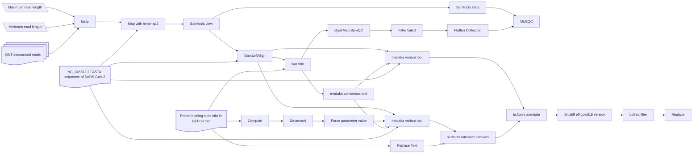

# Workflow diagrams

## COVID-19: variation analysis of ARTIC ONT data

```mermaid
graph LR
0["ONT-sequenced reads"]@{ shape: docs }
1["Minimum read length"]@{ shape: lean-l }
2["Maximum read length"]@{ shape: lean-l }
3["NC_045512.2 FASTA sequence of SARS-CoV-2"]@{ shape: doc }
4["Primer binding sites info in BED format"]@{ shape: doc }
5["fastp"]@{ shape: process }
2 --> 5
1 --> 5
0 --> 5
6["Compute"]@{ shape: process }
4 --> 6
7["Replace Text"]@{ shape: process }
4 --> 7
8["Map with minimap2"]@{ shape: process }
5 --> 8
3 --> 8
9["Datamash"]@{ shape: process }
6 --> 9
10["Samtools view"]@{ shape: process }
8 --> 10
11["Parse parameter value"]@{ shape: process }
9 --> 11
12["Samtools stats"]@{ shape: process }
10 --> 12
13["BamLeftAlign"]@{ shape: process }
10 --> 13
3 --> 13
14["ivar trim"]@{ shape: process }
13 --> 14
4 --> 14
15["QualiMap BamQC"]@{ shape: process }
14 --> 15
16["medaka consensus tool"]@{ shape: process }
14 --> 16
17["Filter failed"]@{ shape: process }
15 --> 17
18["medaka variant tool"]@{ shape: process }
13 --> 18
16 --> 18
3 --> 18
19["medaka variant tool"]@{ shape: process }
13 --> 19
11 --> 19
16 --> 19
3 --> 19
20["Flatten Collection"]@{ shape: process }
17 --> 20
21["bedtools Intersect intervals"]@{ shape: process }
19 --> 21
7 --> 21
22["MultiQC"]@{ shape: process }
12 --> 22
20 --> 22
23["bcftools annotate"]@{ shape: process }
18 --> 23
21 --> 23
24["SnpEff eff covid19 version"]@{ shape: process }
23 --> 24
25["Lofreq filter"]@{ shape: process }
24 --> 25
26["Replace"]@{ shape: process }
25 --> 26
```
