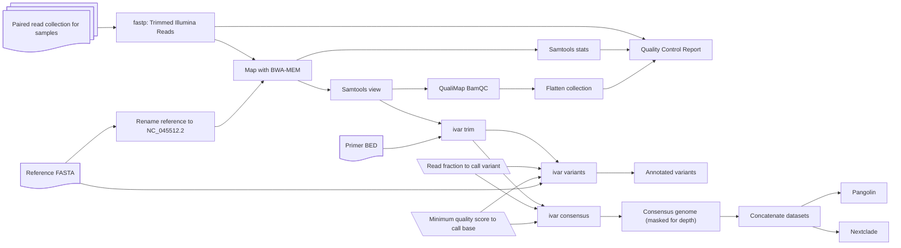

# Workflow diagrams

## SARS-CoV-2 Illumina Amplicon pipeline - iVar based

```mermaid
graph LR
0["Paired read collection for samples"]@{ shape: docs }
1["Reference FASTA"]@{ shape: doc }
2["Primer BED"]@{ shape: doc }
3["Read fraction to call variant"]@{ shape: lean-l }
4["Minimum quality score to call base"]@{ shape: lean-l }
5["fastp: Trimmed Illumina Reads"]@{ shape: process }
0 --> 5
6["Rename reference to NC_045512.2"]@{ shape: process }
1 --> 6
7["Map with BWA-MEM"]@{ shape: process }
5 --> 7
6 --> 7
8["Samtools stats"]@{ shape: process }
7 --> 8
9["Samtools view"]@{ shape: process }
7 --> 9
10["QualiMap BamQC"]@{ shape: process }
9 --> 10
11["ivar trim"]@{ shape: process }
9 --> 11
2 --> 11
12["Flatten collection"]@{ shape: process }
10 --> 12
13["ivar variants"]@{ shape: process }
11 --> 13
3 --> 13
4 --> 13
1 --> 13
14["ivar consensus"]@{ shape: process }
11 --> 14
3 --> 14
4 --> 14
15["Quality Control Report"]@{ shape: process }
5 --> 15
8 --> 15
12 --> 15
16["Annotated variants"]@{ shape: process }
13 --> 16
17["Consensus genome (masked for depth)"]@{ shape: process }
14 --> 17
18["Concatenate datasets"]@{ shape: process }
17 --> 18
19["Pangolin"]@{ shape: process }
18 --> 19
20["Nextclade"]@{ shape: process }
18 --> 20
```
