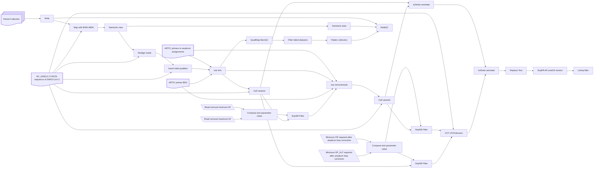

# Workflow diagrams

## COVID-19: variation analysis on ARTIC PE data

```mermaid
graph LR
0["Paired Collection"]@{ shape: docs }
1["NC_045512.2 FASTA sequence of SARS-CoV-2"]@{ shape: doc }
2["ARTIC primer BED"]@{ shape: doc }
3["ARTIC primers to amplicon assignments"]@{ shape: doc }
4["Read removal minimum AF"]@{ shape: lean-l }
5["Read removal maximum AF"]@{ shape: lean-l }
6["Minimum DP required after amplicon bias correction"]@{ shape: lean-l }
7["Minimum DP_ALT required after amplicon bias correction"]@{ shape: lean-l }
8["fastp"]@{ shape: process }
0 --> 8
9["Compose text parameter value"]@{ shape: process }
4 --> 9
5 --> 9
10["Compose text parameter value"]@{ shape: process }
6 --> 10
7 --> 10
11["Map with BWA-MEM"]@{ shape: process }
8 --> 11
1 --> 11
12["Samtools view"]@{ shape: process }
11 --> 12
13["Realign reads"]@{ shape: process }
12 --> 13
1 --> 13
14["Samtools stats"]@{ shape: process }
12 --> 14
15["Insert indel qualities"]@{ shape: process }
13 --> 15
1 --> 15
16["ivar trim"]@{ shape: process }
3 --> 16
15 --> 16
2 --> 16
17["Call variants"]@{ shape: process }
16 --> 17
1 --> 17
18["QualiMap BamQC"]@{ shape: process }
16 --> 18
19["SnpSift Filter"]@{ shape: process }
9 --> 19
17 --> 19
20["SnpSift Filter"]@{ shape: process }
10 --> 20
17 --> 20
21["Filter failed datasets"]@{ shape: process }
18 --> 21
22["ivar removereads"]@{ shape: process }
3 --> 22
16 --> 22
2 --> 22
19 --> 22
23["Flatten collection"]@{ shape: process }
21 --> 23
24["Call variants"]@{ shape: process }
22 --> 24
1 --> 24
25["MultiQC"]@{ shape: process }
8 --> 25
14 --> 25
23 --> 25
26["bcftools annotate"]@{ shape: process }
17 --> 26
24 --> 26
27["SnpSift Filter"]@{ shape: process }
10 --> 27
24 --> 27
28["VCF-VCFintersect:"]@{ shape: process }
1 --> 28
27 --> 28
20 --> 28
29["bcftools annotate"]@{ shape: process }
26 --> 29
28 --> 29
30["Replace Text"]@{ shape: process }
29 --> 30
31["SnpEff eff covid19 version"]@{ shape: process }
30 --> 31
32["Lofreq filter"]@{ shape: process }
31 --> 32
```
