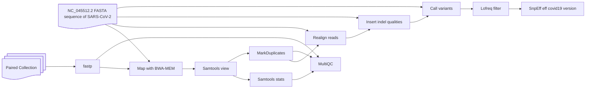

# Workflow diagrams

## COVID-19: variation analysis on WGS PE data

```mermaid
graph LR
0["Paired Collection"]@{ shape: docs }
1["NC_045512.2 FASTA sequence of SARS-CoV-2"]@{ shape: doc }
2["fastp"]@{ shape: process }
0 --> 2
3["Map with BWA-MEM"]@{ shape: process }
2 --> 3
1 --> 3
4["Samtools view"]@{ shape: process }
3 --> 4
5["Samtools stats"]@{ shape: process }
4 --> 5
6["MarkDuplicates"]@{ shape: process }
4 --> 6
7["Realign reads"]@{ shape: process }
6 --> 7
1 --> 7
8["MultiQC"]@{ shape: process }
2 --> 8
5 --> 8
6 --> 8
9["Insert indel qualities"]@{ shape: process }
7 --> 9
1 --> 9
10["Call variants"]@{ shape: process }
9 --> 10
1 --> 10
11["Lofreq filter"]@{ shape: process }
10 --> 11
12["SnpEff eff covid19 version"]@{ shape: process }
11 --> 12
```
