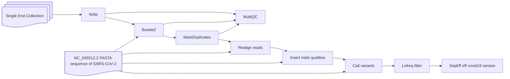

# Workflow diagrams

## COVID-19: variation analysis on WGS SE data

```mermaid
graph LR
0["Single End Collection"]@{ shape: docs }
1["NC_045512.2 FASTA sequence of SARS-CoV-2"]@{ shape: doc }
2["fastp"]@{ shape: process }
0 --> 2
3["Bowtie2"]@{ shape: process }
2 --> 3
1 --> 3
4["MarkDuplicates"]@{ shape: process }
3 --> 4
5["MultiQC"]@{ shape: process }
2 --> 5
3 --> 5
4 --> 5
6["Realign reads"]@{ shape: process }
4 --> 6
1 --> 6
7["Insert indel qualities"]@{ shape: process }
6 --> 7
1 --> 7
8["Call variants"]@{ shape: process }
7 --> 8
1 --> 8
9["Lofreq filter"]@{ shape: process }
8 --> 9
10["SnpEff eff covid19 version"]@{ shape: process }
9 --> 10
```
