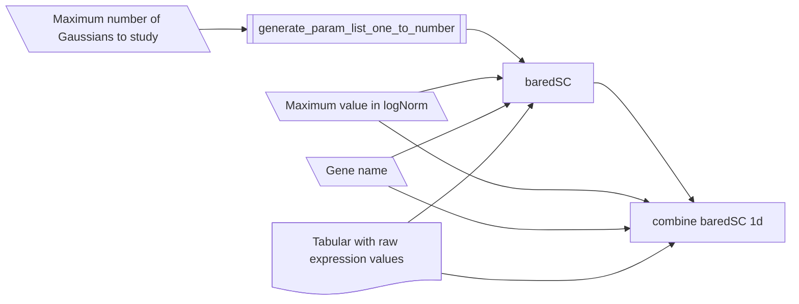
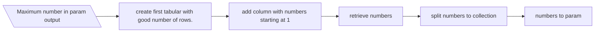

# Workflow diagrams

## baredSC_1d_logNorm

```mermaid
graph LR
0["Tabular with raw expression values"]@{ shape: doc }
1["Gene name"]@{ shape: lean-l }
2["Maximum value in logNorm"]@{ shape: lean-l }
3["Maximum number of Gaussians to study"]@{ shape: lean-l }
4["generate_param_list_one_to_number"]@{ shape: subprocess }
3 --> 4
5["baredSC"]@{ shape: process }
4 --> 5
2 --> 5
1 --> 5
0 --> 5
6["combine baredSC 1d"]@{ shape: process }
5 --> 6
2 --> 6
1 --> 6
0 --> 6
```

## generate_param_list_one_to_number

```mermaid
graph LR
0["Maximum number in param output"]@{ shape: lean-l }
1["create first tabular with good number of rows."]@{ shape: process }
0 --> 1
2["add column with numbers starting at 1"]@{ shape: process }
1 --> 2
3["retrieve numbers"]@{ shape: process }
2 --> 3
4["split numbers to collection"]@{ shape: process }
3 --> 4
5["numbers to param"]@{ shape: process }
4 --> 5
```
