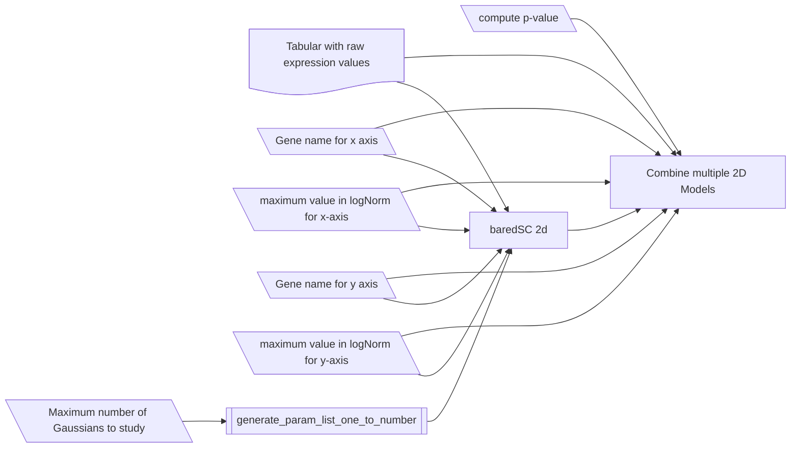
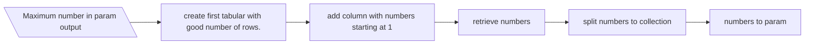

# Workflow diagrams

## baredSC_2d_logNorm

```mermaid
graph LR
0["Tabular with raw expression values"]@{ shape: doc }
1["Gene name for x axis"]@{ shape: lean-l }
2["maximum value in logNorm for x-axis"]@{ shape: lean-l }
3["Gene name for y axis"]@{ shape: lean-l }
4["maximum value in logNorm for y-axis"]@{ shape: lean-l }
5["Maximum number of Gaussians to study"]@{ shape: lean-l }
6["compute p-value"]@{ shape: lean-l }
7["generate_param_list_one_to_number"]@{ shape: subprocess }
5 --> 7
8["baredSC 2d"]@{ shape: process }
7 --> 8
2 --> 8
4 --> 8
1 --> 8
3 --> 8
0 --> 8
9["Combine multiple 2D Models"]@{ shape: process }
8 --> 9
2 --> 9
4 --> 9
6 --> 9
1 --> 9
3 --> 9
0 --> 9
```

## generate_param_list_one_to_number

```mermaid
graph LR
0["Maximum number in param output"]@{ shape: lean-l }
1["create first tabular with good number of rows."]@{ shape: process }
0 --> 1
2["add column with numbers starting at 1"]@{ shape: process }
1 --> 2
3["retrieve numbers"]@{ shape: process }
2 --> 3
4["split numbers to collection"]@{ shape: process }
3 --> 4
5["numbers to param"]@{ shape: process }
4 --> 5
```
