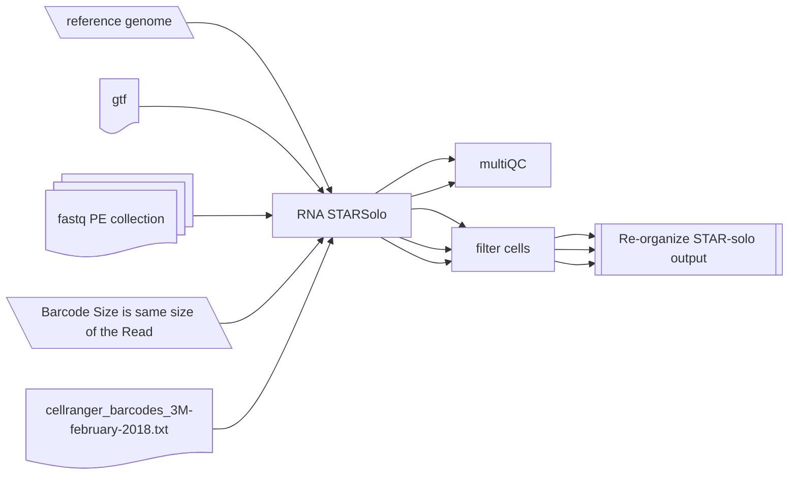
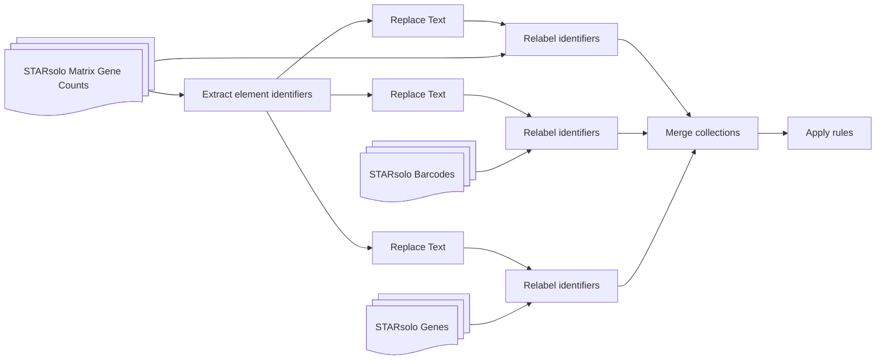

# Workflow diagrams

## scRNA-seq_preprocessing_10X_v3_Bundle

```mermaid
graph LR
0["fastq PE collection"]@{ shape: docs }
1["reference genome"]@{ shape: lean-l }
2["gtf"]@{ shape: doc }
3["cellranger_barcodes_3M-february-2018.txt"]@{ shape: doc }
4["Barcode Size is same size of the Read"]@{ shape: lean-l }
5["RNA STARSolo"]@{ shape: process }
1 --> 5
2 --> 5
0 --> 5
4 --> 5
3 --> 5
6["multiQC"]@{ shape: process }
5 --> 6
5 --> 6
7["filter cells"]@{ shape: process }
5 --> 7
5 --> 7
5 --> 7
8["Re-organize STAR-solo output"]@{ shape: subprocess }
7 --> 8
7 --> 8
7 --> 8
```

## Re-organize-STAR-solo-output

```mermaid
graph LR
0["STARsolo Genes"]@{ shape: docs }
1["STARsolo Barcodes"]@{ shape: docs }
2["STARsolo Matrix Gene Counts"]@{ shape: docs }
3["Extract element identifiers"]@{ shape: process }
2 --> 3
4["Replace Text"]@{ shape: process }
3 --> 4
5["Replace Text"]@{ shape: process }
3 --> 5
6["Replace Text"]@{ shape: process }
3 --> 6
7["Relabel identifiers"]@{ shape: process }
4 --> 7
0 --> 7
8["Relabel identifiers"]@{ shape: process }
5 --> 8
1 --> 8
9["Relabel identifiers"]@{ shape: process }
6 --> 9
2 --> 9
10["Merge collections"]@{ shape: process }
9 --> 10
8 --> 10
7 --> 10
11["Apply rules"]@{ shape: process }
10 --> 11
```
