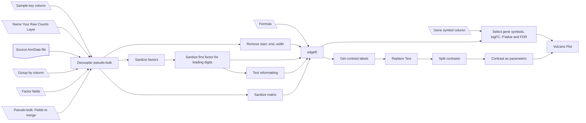

# Workflow diagrams

## Differential gene expression for single-cell data using pseudo-bulk counts with edgeR

```mermaid
graph LR
0["Source AnnData file"]@{ shape: doc }
1["Pseudo-bulk: Fields to merge"]@{ shape: lean-l }
2["Group by column"]@{ shape: lean-l }
3["Sample key column"]@{ shape: lean-l }
4["Name Your Raw Counts Layer"]@{ shape: lean-l }
5["Factor fields"]@{ shape: lean-l }
6["Formula"]@{ shape: lean-l }
7["Gene symbol column"]@{ shape: lean-l }
8["Decoupler pseudo-bulk"]@{ shape: process }
1 --> 8
5 --> 8
2 --> 8
0 --> 8
4 --> 8
3 --> 8
9["Sanitize matrix"]@{ shape: process }
8 --> 9
10["Sanitize factors"]@{ shape: process }
8 --> 10
11["Remove start, end, width"]@{ shape: process }
8 --> 11
12["Sanitize first factor for leading digits"]@{ shape: process }
10 --> 12
13["Text reformatting"]@{ shape: process }
12 --> 13
14["edgeR"]@{ shape: process }
11 --> 14
13 --> 14
6 --> 14
9 --> 14
12 --> 14
15["Get contrast labels"]@{ shape: process }
14 --> 15
16["Select gene symbols, logFC, PValue and FDR"]@{ shape: process }
7 --> 16
14 --> 16
17["Replace Text"]@{ shape: process }
15 --> 17
18["Split contrasts"]@{ shape: process }
17 --> 18
19["Contrast as parameters"]@{ shape: process }
18 --> 19
20["Volcano Plot"]@{ shape: process }
16 --> 20
19 --> 20
```
