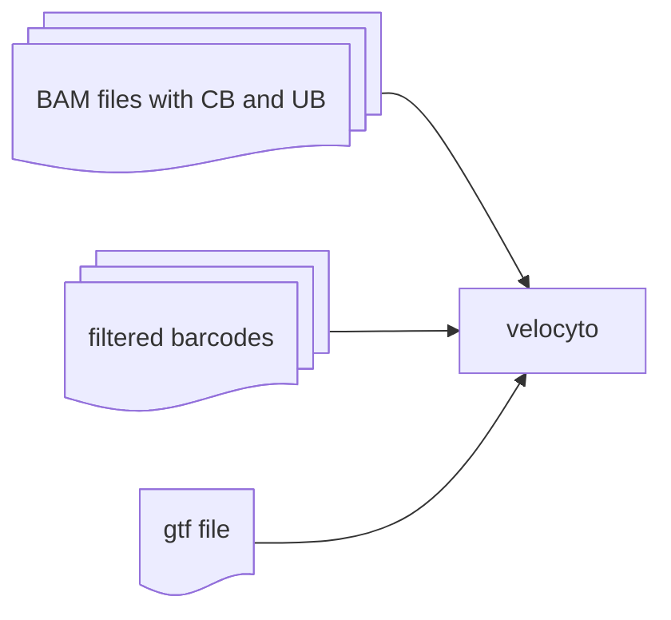

# Workflow diagrams

## Velocyto-on10X-filtered-barcodes

```mermaid
graph LR
0["BAM files with CB and UB"]@{ shape: docs }
1["filtered barcodes"]@{ shape: docs }
2["gtf file"]@{ shape: doc }
3["velocyto"]@{ shape: process }
0 --> 3
1 --> 3
2 --> 3
```
