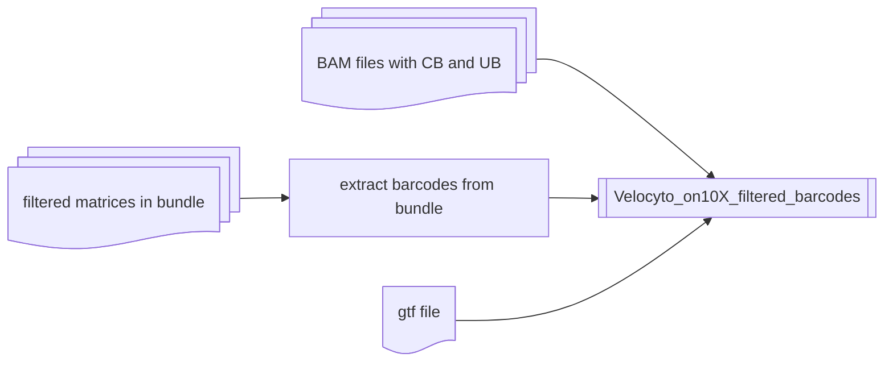
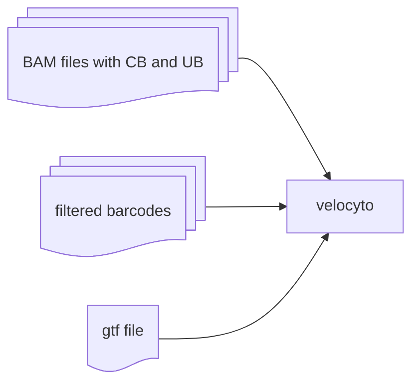

# Workflow diagrams

## Velocyto-on10X-from-bundled

```mermaid
graph LR
0["BAM files with CB and UB"]@{ shape: docs }
1["filtered matrices in bundle"]@{ shape: docs }
2["gtf file"]@{ shape: doc }
3["extract barcodes from bundle"]@{ shape: process }
1 --> 3
4["Velocyto_on10X_filtered_barcodes"]@{ shape: subprocess }
0 --> 4
3 --> 4
2 --> 4
```

## Velocyto_on10X_filtered_barcodes

```mermaid
graph LR
0["BAM files with CB and UB"]@{ shape: docs }
1["filtered barcodes"]@{ shape: docs }
2["gtf file"]@{ shape: doc }
3["velocyto"]@{ shape: process }
0 --> 3
1 --> 3
2 --> 3
```
