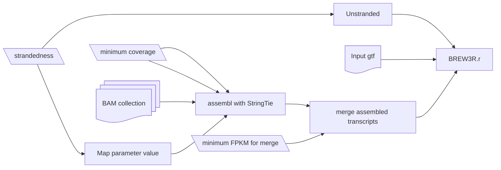

# Workflow diagrams

## BREW3R

```mermaid
graph LR
0["Input gtf"]@{ shape: doc }
1["BAM collection"]@{ shape: docs }
2["strandedness"]@{ shape: lean-l }
3["minimum coverage"]@{ shape: lean-l }
4["minimum FPKM for merge"]@{ shape: lean-l }
5["Map parameter value"]@{ shape: process }
2 --> 5
6["Unstranded"]@{ shape: process }
2 --> 6
7["assembl with StringTie"]@{ shape: process }
3 --> 7
3 --> 7
1 --> 7
5 --> 7
8["merge assembled transcripts"]@{ shape: process }
7 --> 8
4 --> 8
9["BREW3R.r"]@{ shape: process }
6 --> 9
0 --> 9
8 --> 9
```
