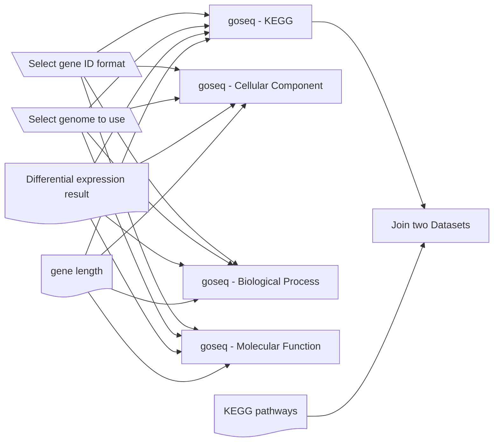

# Workflow diagrams

## Goseq GO-KEGG Enrichment Analysis

```mermaid
graph LR
0["Select genome to use"]@{ shape: lean-l }
1["Differential expression result"]@{ shape: doc }
2["Select gene ID format"]@{ shape: lean-l }
3["gene length"]@{ shape: doc }
4["KEGG pathways"]@{ shape: doc }
5["goseq - Cellular Component"]@{ shape: process }
2 --> 5
0 --> 5
1 --> 5
3 --> 5
6["goseq - Biological Process"]@{ shape: process }
2 --> 6
0 --> 6
1 --> 6
3 --> 6
7["goseq - Molecular Function"]@{ shape: process }
2 --> 7
0 --> 7
1 --> 7
3 --> 7
8["goseq - KEGG"]@{ shape: process }
2 --> 8
0 --> 8
1 --> 8
3 --> 8
9["Join two Datasets"]@{ shape: process }
8 --> 9
4 --> 9
```
