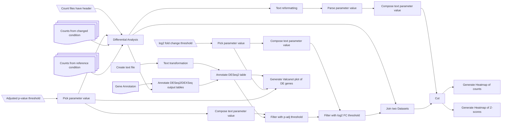

# Workflow diagrams

## RNAseq_DE_filtering_plotting

```mermaid
graph LR
0["Counts from changed condition"]@{ shape: docs }
1["Counts from reference condition"]@{ shape: docs }
2["Count files have header"]@{ shape: lean-l }
3["Gene Annotaton"]@{ shape: doc }
4["Adjusted p-value threshold"]@{ shape: lean-l }
5["Create text file"]@{ shape: process }
6["log2 fold change threshold"]@{ shape: lean-l }
7["Pick parameter value"]@{ shape: process }
4 --> 7
8["Text transformation"]@{ shape: process }
5 --> 8
9["Pick parameter value"]@{ shape: process }
6 --> 9
10["Differential Analysis"]@{ shape: process }
2 --> 10
7 --> 10
0 --> 10
1 --> 10
11["Compose text parameter value"]@{ shape: process }
7 --> 11
12["Compose text parameter value"]@{ shape: process }
9 --> 12
13["Annotate DESeq2/DEXSeq output tables"]@{ shape: process }
3 --> 13
10 --> 13
14["Text reformatting"]@{ shape: process }
10 --> 14
15["Annotate DESeq2 table"]@{ shape: process }
8 --> 15
13 --> 15
16["Parse parameter value"]@{ shape: process }
14 --> 16
17["Filter with p-adj threshold"]@{ shape: process }
11 --> 17
15 --> 17
18["Generate Valcanot plot of DE genes"]@{ shape: process }
15 --> 18
9 --> 18
7 --> 18
19["Compose text parameter value"]@{ shape: process }
16 --> 19
20["Filter with log2 FC threshold"]@{ shape: process }
12 --> 20
17 --> 20
21["Join two Datasets"]@{ shape: process }
10 --> 21
20 --> 21
22["Cut"]@{ shape: process }
19 --> 22
21 --> 22
23["Generate Heatmap of counts"]@{ shape: process }
22 --> 23
24["Generate Heatmap of Z-scores"]@{ shape: process }
22 --> 24
```
