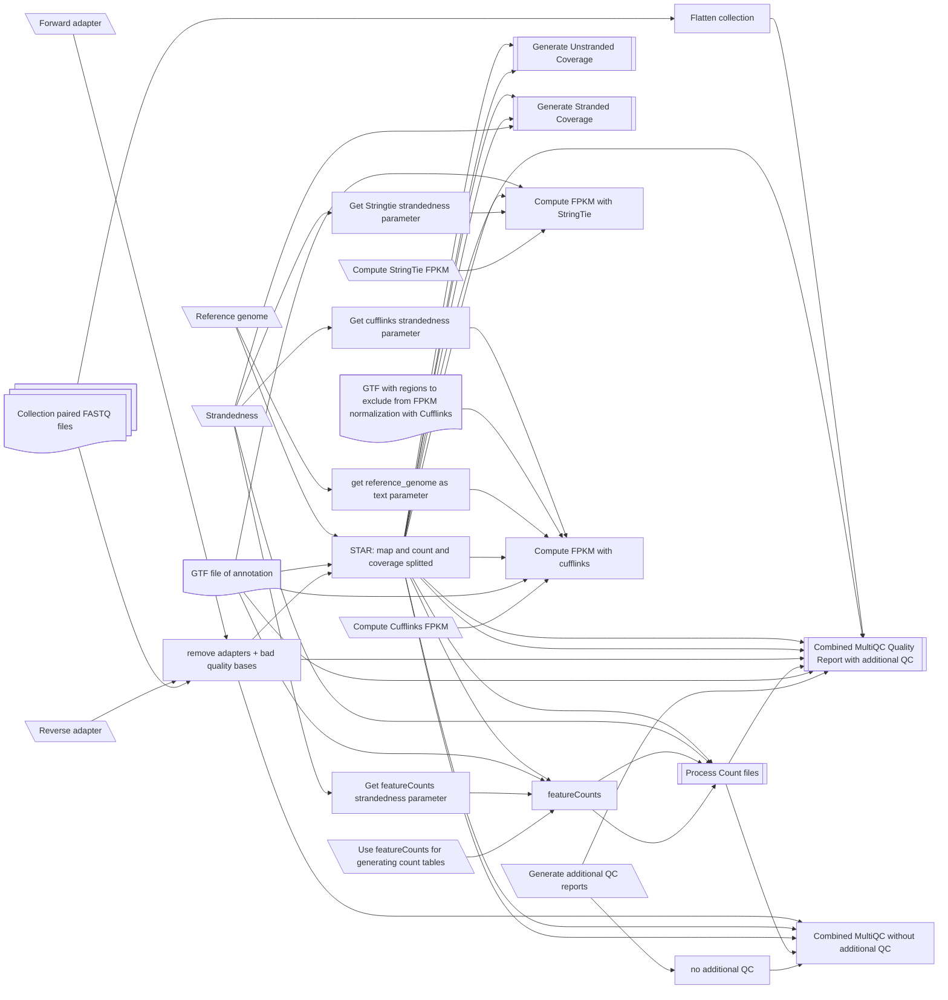
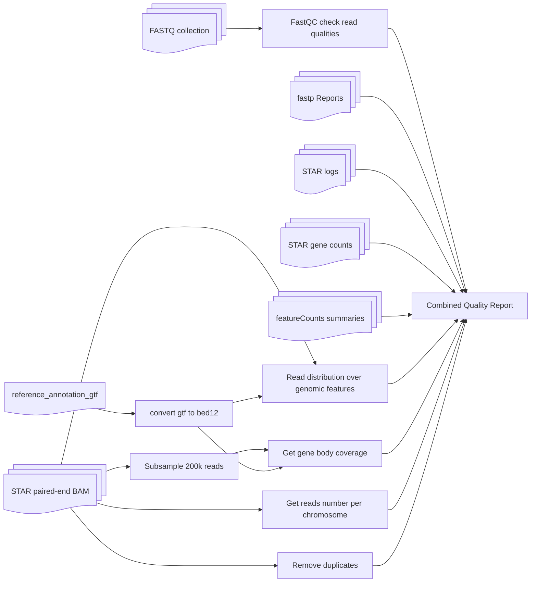
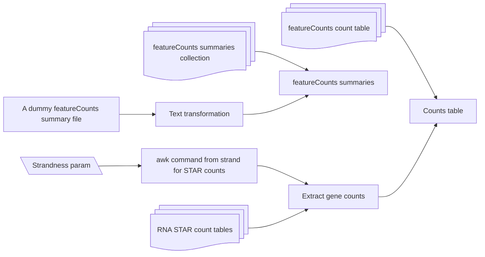
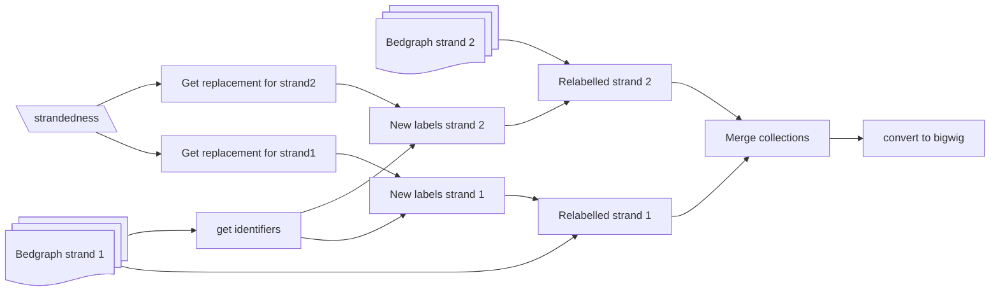
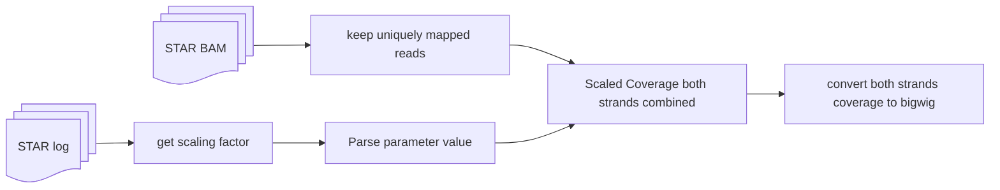

# Workflow diagrams

## RNA-seq for Paired-end fastqs

```mermaid
graph LR
0["Collection paired FASTQ files"]@{ shape: docs }
1["Forward adapter"]@{ shape: lean-l }
2["Reverse adapter"]@{ shape: lean-l }
3["Generate additional QC reports"]@{ shape: lean-l }
4["Reference genome"]@{ shape: lean-l }
5["GTF file of annotation"]@{ shape: doc }
6["Strandedness"]@{ shape: lean-l }
7["Use featureCounts for generating count tables"]@{ shape: lean-l }
8["Compute Cufflinks FPKM"]@{ shape: lean-l }
9["GTF with regions to exclude from FPKM normalization with Cufflinks"]@{ shape: doc }
10["Compute StringTie FPKM"]@{ shape: lean-l }
11["Flatten collection"]@{ shape: process }
0 --> 11
12["remove adapters + bad quality bases"]@{ shape: process }
1 --> 12
2 --> 12
0 --> 12
13["no additional QC"]@{ shape: process }
3 --> 13
14["get reference_genome as text parameter"]@{ shape: process }
4 --> 14
15["Get featureCounts strandedness parameter"]@{ shape: process }
6 --> 15
16["Get cufflinks strandedness parameter"]@{ shape: process }
6 --> 16
17["Get Stringtie strandedness parameter"]@{ shape: process }
6 --> 17
18["STAR: map and count and coverage splitted"]@{ shape: process }
4 --> 18
5 --> 18
12 --> 18
19["Generate Unstranded Coverage"]@{ shape: subprocess }
18 --> 19
18 --> 19
20["Generate Stranded Coverage"]@{ shape: subprocess }
18 --> 20
18 --> 20
6 --> 20
21["featureCounts"]@{ shape: process }
18 --> 21
5 --> 21
15 --> 21
7 --> 21
22["Compute FPKM with StringTie"]@{ shape: process }
5 --> 22
18 --> 22
17 --> 22
10 --> 22
23["Compute FPKM with cufflinks"]@{ shape: process }
16 --> 23
9 --> 23
14 --> 23
18 --> 23
5 --> 23
8 --> 23
24["Process Count files"]@{ shape: subprocess }
18 --> 24
6 --> 24
21 --> 24
21 --> 24
25["Combined MultiQC without additional QC"]@{ shape: process }
12 --> 25
18 --> 25
18 --> 25
24 --> 25
13 --> 25
26["Combined MultiQC Quality Report with additional QC"]@{ shape: subprocess }
11 --> 26
18 --> 26
18 --> 26
18 --> 26
12 --> 26
24 --> 26
5 --> 26
3 --> 26
```

## RNA-seq-Paired-QC

```mermaid
graph LR
0["FASTQ collection"]@{ shape: docs }
1["fastp Reports"]@{ shape: docs }
2["STAR logs"]@{ shape: docs }
3["STAR gene counts"]@{ shape: docs }
4["featureCounts summaries"]@{ shape: docs }
5["reference_annotation_gtf"]@{ shape: doc }
6["STAR paired-end BAM"]@{ shape: docs }
7["FastQC check read qualities"]@{ shape: process }
0 --> 7
8["convert gtf to bed12"]@{ shape: process }
5 --> 8
9["Subsample 200k reads"]@{ shape: process }
6 --> 9
10["Get reads number per chromosome"]@{ shape: process }
6 --> 10
11["Remove duplicates"]@{ shape: process }
6 --> 11
12["Read distribution over genomic features"]@{ shape: process }
6 --> 12
8 --> 12
13["Get gene body coverage"]@{ shape: process }
9 --> 13
8 --> 13
14["Combined Quality Report"]@{ shape: process }
7 --> 14
1 --> 14
2 --> 14
3 --> 14
4 --> 14
12 --> 14
13 --> 14
10 --> 14
11 --> 14
```

## Process Count files

```mermaid
graph LR
0["A dummy featureCounts summary file"]@{ shape: process }
1["featureCounts summaries collection"]@{ shape: docs }
2["Strandness param"]@{ shape: lean-l }
3["RNA STAR count tables"]@{ shape: docs }
4["featureCounts count table"]@{ shape: docs }
5["Text transformation"]@{ shape: process }
0 --> 5
6["awk command from strand for STAR counts"]@{ shape: process }
2 --> 6
7["featureCounts summaries"]@{ shape: process }
1 --> 7
5 --> 7
8["Extract gene counts"]@{ shape: process }
6 --> 8
3 --> 8
9["Counts table"]@{ shape: process }
4 --> 9
8 --> 9
```

## Re-arrange Stranded RNA-seq coverage

```mermaid
graph LR
0["strandedness"]@{ shape: lean-l }
1["Bedgraph strand 1"]@{ shape: docs }
2["Bedgraph strand 2"]@{ shape: docs }
3["Get replacement for strand2"]@{ shape: process }
0 --> 3
4["Get replacement for strand1"]@{ shape: process }
0 --> 4
5["get identifiers"]@{ shape: process }
1 --> 5
6["New labels strand 2"]@{ shape: process }
3 --> 6
5 --> 6
7["New labels strand 1"]@{ shape: process }
4 --> 7
5 --> 7
8["Relabelled strand 2"]@{ shape: process }
6 --> 8
2 --> 8
9["Relabelled strand 1"]@{ shape: process }
7 --> 9
1 --> 9
10["Merge collections"]@{ shape: process }
9 --> 10
8 --> 10
11["convert to bigwig"]@{ shape: process }
10 --> 11
```

## Get Uniquely mapped unstranded coverage

```mermaid
graph LR
0["STAR log"]@{ shape: docs }
1["STAR BAM"]@{ shape: docs }
2["get scaling factor"]@{ shape: process }
0 --> 2
3["keep uniquely mapped reads"]@{ shape: process }
1 --> 3
4["Parse parameter value"]@{ shape: process }
2 --> 4
5["Scaled Coverage both strands combined"]@{ shape: process }
3 --> 5
4 --> 5
6["convert both strands coverage to bigwig"]@{ shape: process }
5 --> 6
```
