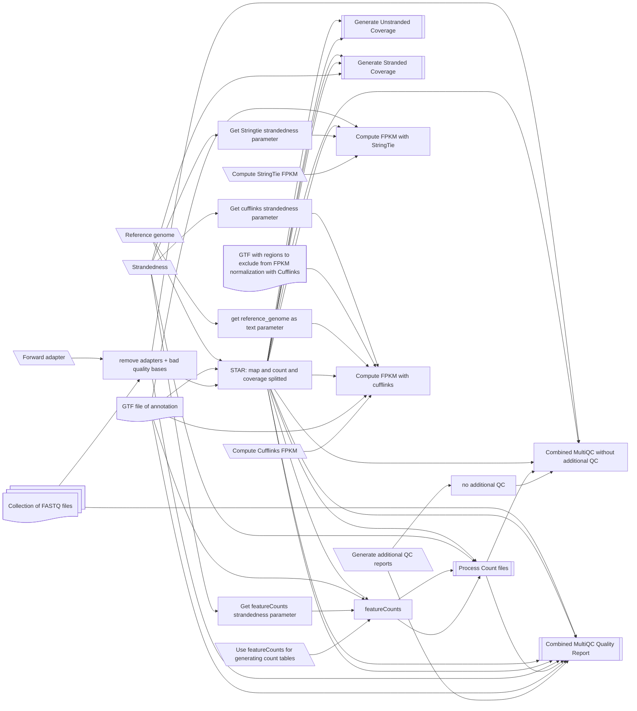
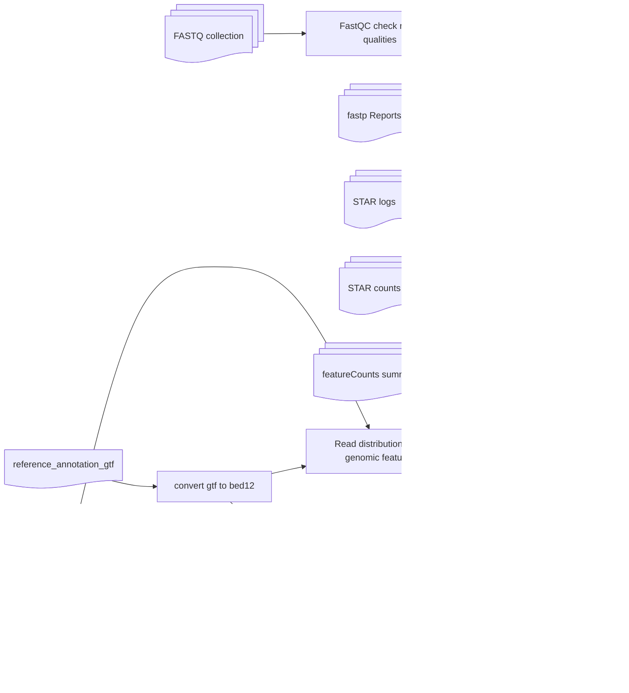
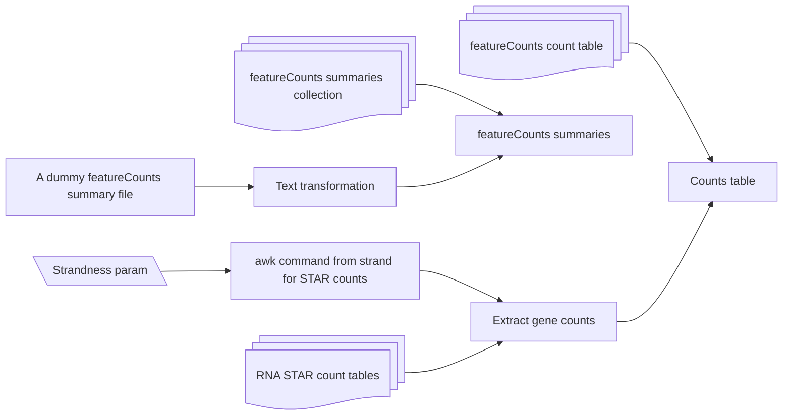
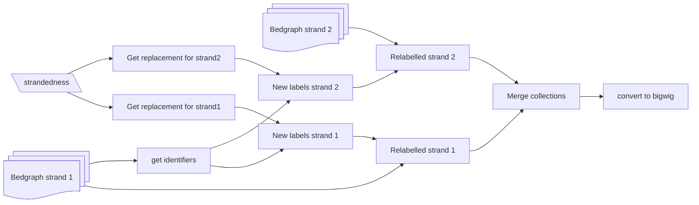
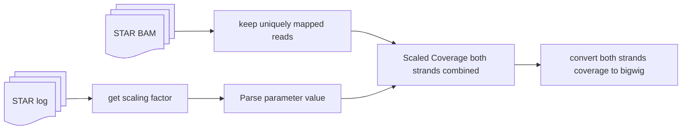

# Workflow diagrams

## RNA-seq for Single-read fastqs

```mermaid
graph LR
0["Collection of FASTQ files"]@{ shape: docs }
1["Forward adapter"]@{ shape: lean-l }
2["Generate additional QC reports"]@{ shape: lean-l }
3["Reference genome"]@{ shape: lean-l }
4["GTF file of annotation"]@{ shape: doc }
5["Strandedness"]@{ shape: lean-l }
6["Use featureCounts for generating count tables"]@{ shape: lean-l }
7["Compute Cufflinks FPKM"]@{ shape: lean-l }
8["GTF with regions to exclude from FPKM normalization with Cufflinks"]@{ shape: doc }
9["Compute StringTie FPKM"]@{ shape: lean-l }
10["remove adapters + bad quality bases"]@{ shape: process }
1 --> 10
0 --> 10
11["no additional QC"]@{ shape: process }
2 --> 11
12["get reference_genome as text parameter"]@{ shape: process }
3 --> 12
13["Get featureCounts strandedness parameter"]@{ shape: process }
5 --> 13
14["Get cufflinks strandedness parameter"]@{ shape: process }
5 --> 14
15["Get Stringtie strandedness parameter"]@{ shape: process }
5 --> 15
16["STAR: map and count and coverage splitted"]@{ shape: process }
3 --> 16
4 --> 16
10 --> 16
17["Generate Unstranded Coverage"]@{ shape: subprocess }
16 --> 17
16 --> 17
18["Generate Stranded Coverage"]@{ shape: subprocess }
16 --> 18
16 --> 18
5 --> 18
19["featureCounts"]@{ shape: process }
16 --> 19
4 --> 19
13 --> 19
6 --> 19
20["Compute FPKM with StringTie"]@{ shape: process }
4 --> 20
16 --> 20
15 --> 20
9 --> 20
21["Compute FPKM with cufflinks"]@{ shape: process }
14 --> 21
8 --> 21
12 --> 21
16 --> 21
4 --> 21
7 --> 21
22["Process Count files"]@{ shape: subprocess }
16 --> 22
5 --> 22
19 --> 22
19 --> 22
23["Combined MultiQC without additional QC"]@{ shape: process }
10 --> 23
16 --> 23
16 --> 23
22 --> 23
11 --> 23
24["Combined MultiQC Quality Report"]@{ shape: subprocess }
0 --> 24
16 --> 24
16 --> 24
16 --> 24
10 --> 24
22 --> 24
4 --> 24
2 --> 24
```

## RNA-seq-QC

```mermaid
graph LR
0["FASTQ collection"]@{ shape: docs }
1["fastp Reports"]@{ shape: docs }
2["STAR logs"]@{ shape: docs }
3["STAR counts"]@{ shape: docs }
4["featureCounts summaries"]@{ shape: docs }
5["reference_annotation_gtf"]@{ shape: doc }
6["STAR BAM"]@{ shape: docs }
7["FastQC check read qualities"]@{ shape: process }
0 --> 7
8["convert gtf to bed12"]@{ shape: process }
5 --> 8
9["Subsample 200k reads"]@{ shape: process }
6 --> 9
10["Get reads number per chromosome"]@{ shape: process }
6 --> 10
11["Remove duplicates"]@{ shape: process }
6 --> 11
12["Read distribution over genomic features"]@{ shape: process }
6 --> 12
8 --> 12
13["Get gene body coverage"]@{ shape: process }
9 --> 13
8 --> 13
14["Combined Quality Report"]@{ shape: process }
7 --> 14
1 --> 14
2 --> 14
3 --> 14
4 --> 14
12 --> 14
13 --> 14
10 --> 14
11 --> 14
```

## Process Count files

```mermaid
graph LR
0["A dummy featureCounts summary file"]@{ shape: process }
1["featureCounts summaries collection"]@{ shape: docs }
2["Strandness param"]@{ shape: lean-l }
3["RNA STAR count tables"]@{ shape: docs }
4["featureCounts count table"]@{ shape: docs }
5["Text transformation"]@{ shape: process }
0 --> 5
6["awk command from strand for STAR counts"]@{ shape: process }
2 --> 6
7["featureCounts summaries"]@{ shape: process }
1 --> 7
5 --> 7
8["Extract gene counts"]@{ shape: process }
6 --> 8
3 --> 8
9["Counts table"]@{ shape: process }
4 --> 9
8 --> 9
```

## Re-arrange Stranded RNA-seq coverage

```mermaid
graph LR
0["strandedness"]@{ shape: lean-l }
1["Bedgraph strand 1"]@{ shape: docs }
2["Bedgraph strand 2"]@{ shape: docs }
3["Get replacement for strand2"]@{ shape: process }
0 --> 3
4["Get replacement for strand1"]@{ shape: process }
0 --> 4
5["get identifiers"]@{ shape: process }
1 --> 5
6["New labels strand 2"]@{ shape: process }
3 --> 6
5 --> 6
7["New labels strand 1"]@{ shape: process }
4 --> 7
5 --> 7
8["Relabelled strand 2"]@{ shape: process }
6 --> 8
2 --> 8
9["Relabelled strand 1"]@{ shape: process }
7 --> 9
1 --> 9
10["Merge collections"]@{ shape: process }
9 --> 10
8 --> 10
11["convert to bigwig"]@{ shape: process }
10 --> 11
```

## Get Uniquely mapped unstranded coverage

```mermaid
graph LR
0["STAR log"]@{ shape: docs }
1["STAR BAM"]@{ shape: docs }
2["get scaling factor"]@{ shape: process }
0 --> 2
3["keep uniquely mapped reads"]@{ shape: process }
1 --> 3
4["Parse parameter value"]@{ shape: process }
2 --> 4
5["Scaled Coverage both strands combined"]@{ shape: process }
3 --> 5
4 --> 5
6["convert both strands coverage to bigwig"]@{ shape: process }
5 --> 6
```
