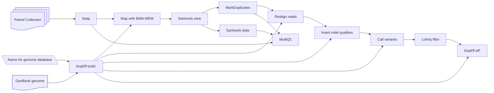

# Workflow diagrams

## Generic variation analysis on WGS PE data

```mermaid
graph LR
0["Paired Collection"]@{ shape: docs }
1["GenBank genome"]@{ shape: doc }
2["Name for genome database"]@{ shape: lean-l }
3["fastp"]@{ shape: process }
0 --> 3
4["SnpEff build:"]@{ shape: process }
2 --> 4
1 --> 4
5["Map with BWA-MEM"]@{ shape: process }
3 --> 5
4 --> 5
6["Samtools view"]@{ shape: process }
5 --> 6
7["MarkDuplicates"]@{ shape: process }
6 --> 7
8["Samtools stats"]@{ shape: process }
6 --> 8
9["Realign reads"]@{ shape: process }
7 --> 9
4 --> 9
10["MultiQC"]@{ shape: process }
3 --> 10
8 --> 10
7 --> 10
11["Insert indel qualities"]@{ shape: process }
9 --> 11
4 --> 11
12["Call variants"]@{ shape: process }
11 --> 12
4 --> 12
13["Lofreq filter"]@{ shape: process }
12 --> 13
14["SnpEff eff:"]@{ shape: process }
13 --> 14
4 --> 14
```
