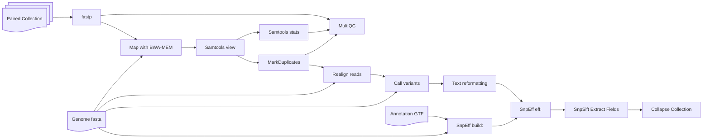

# Workflow diagrams

## Paired end variant calling in haploid system

```mermaid
graph LR
0["Paired Collection"]@{ shape: docs }
1["Annotation GTF"]@{ shape: doc }
2["Genome fasta"]@{ shape: doc }
3["fastp"]@{ shape: process }
0 --> 3
4["SnpEff build:"]@{ shape: process }
1 --> 4
2 --> 4
5["Map with BWA-MEM"]@{ shape: process }
3 --> 5
2 --> 5
6["Samtools view"]@{ shape: process }
5 --> 6
7["Samtools stats"]@{ shape: process }
6 --> 7
8["MarkDuplicates"]@{ shape: process }
6 --> 8
9["MultiQC"]@{ shape: process }
3 --> 9
7 --> 9
8 --> 9
10["Realign reads"]@{ shape: process }
8 --> 10
2 --> 10
11["Call variants"]@{ shape: process }
10 --> 11
2 --> 11
12["Text reformatting"]@{ shape: process }
11 --> 12
13["SnpEff eff:"]@{ shape: process }
12 --> 13
4 --> 13
14["SnpSift Extract Fields"]@{ shape: process }
13 --> 14
15["Collapse Collection"]@{ shape: process }
14 --> 15
```
