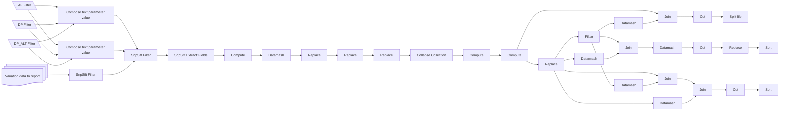

# Workflow diagrams

## Generic variation analysis reporting

```mermaid
graph LR
0["Variation data to report"]@{ shape: docs }
1["AF Filter"]@{ shape: lean-l }
2["DP Filter"]@{ shape: lean-l }
3["DP_ALT Filter"]@{ shape: lean-l }
4["SnpSift Filter"]@{ shape: process }
0 --> 4
5["Compose text parameter value"]@{ shape: process }
1 --> 5
2 --> 5
3 --> 5
6["Compose text parameter value"]@{ shape: process }
1 --> 6
2 --> 6
3 --> 6
7["SnpSift Filter"]@{ shape: process }
5 --> 7
6 --> 7
4 --> 7
8["SnpSift Extract Fields"]@{ shape: process }
7 --> 8
9["Compute"]@{ shape: process }
8 --> 9
10["Datamash"]@{ shape: process }
9 --> 10
11["Replace"]@{ shape: process }
10 --> 11
12["Replace"]@{ shape: process }
11 --> 12
13["Replace"]@{ shape: process }
12 --> 13
14["Collapse Collection"]@{ shape: process }
13 --> 14
15["Compute"]@{ shape: process }
14 --> 15
16["Compute"]@{ shape: process }
15 --> 16
17["Replace"]@{ shape: process }
16 --> 17
18["Datamash"]@{ shape: process }
17 --> 18
19["Filter"]@{ shape: process }
17 --> 19
20["Datamash"]@{ shape: process }
17 --> 20
21["Datamash"]@{ shape: process }
19 --> 21
22["Join"]@{ shape: process }
19 --> 22
18 --> 22
23["Datamash"]@{ shape: process }
19 --> 23
24["Join"]@{ shape: process }
16 --> 24
21 --> 24
25["Datamash"]@{ shape: process }
22 --> 25
26["Join"]@{ shape: process }
17 --> 26
23 --> 26
27["Cut"]@{ shape: process }
24 --> 27
28["Cut"]@{ shape: process }
25 --> 28
29["Join"]@{ shape: process }
26 --> 29
20 --> 29
30["Split file"]@{ shape: process }
27 --> 30
31["Replace"]@{ shape: process }
28 --> 31
32["Cut"]@{ shape: process }
29 --> 32
33["Sort"]@{ shape: process }
31 --> 33
34["Sort"]@{ shape: process }
32 --> 34
```
