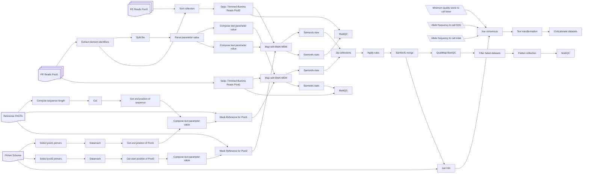

# Workflow diagrams

## Pox Virus Illumina Amplicon Workflow from half-genomes

```mermaid
graph LR
0["Reference FASTA"]@{ shape: doc }
1["Primer Scheme"]@{ shape: doc }
2["PE Reads Pool1"]@{ shape: docs }
3["PE Reads Pool2"]@{ shape: docs }
4["Minimum quality score to call base"]@{ shape: lean-l }
5["Allele frequency to call SNV"]@{ shape: lean-l }
6["Allele frequency to call indel"]@{ shape: lean-l }
7["Compute sequence length"]@{ shape: process }
0 --> 7
8["Select pool1 primers"]@{ shape: process }
1 --> 8
9["Select pool2 primers"]@{ shape: process }
1 --> 9
10["Extract element identifiers"]@{ shape: process }
2 --> 10
11["fastp: Trimmed Illumina Reads Pool1"]@{ shape: process }
2 --> 11
12["Cut"]@{ shape: process }
7 --> 12
13["Datamash"]@{ shape: process }
8 --> 13
14["Datamash"]@{ shape: process }
9 --> 14
15["Split file"]@{ shape: process }
10 --> 15
16["Sort collection"]@{ shape: process }
3 --> 16
10 --> 16
17["Get end position of sequence"]@{ shape: process }
12 --> 17
18["Get end position of Pool1"]@{ shape: process }
13 --> 18
19["Get start position of Pool2"]@{ shape: process }
14 --> 19
20["Parse parameter value"]@{ shape: process }
15 --> 20
21["fastp: Trimmed Illumina Reads Pool2"]@{ shape: process }
16 --> 21
22["Compose text parameter value"]@{ shape: process }
18 --> 22
17 --> 22
23["Compose text parameter value"]@{ shape: process }
19 --> 23
24["Compose text parameter value"]@{ shape: process }
20 --> 24
25["Compose text parameter value"]@{ shape: process }
20 --> 25
26["Mask Reference for Pool1"]@{ shape: process }
0 --> 26
22 --> 26
27["Mask Reference for Pool2"]@{ shape: process }
0 --> 27
23 --> 27
28["Map with BWA-MEM"]@{ shape: process }
11 --> 28
26 --> 28
24 --> 28
29["Map with BWA-MEM"]@{ shape: process }
21 --> 29
27 --> 29
25 --> 29
30["Samtools view"]@{ shape: process }
28 --> 30
31["Samtools stats"]@{ shape: process }
28 --> 31
32["Samtools view"]@{ shape: process }
29 --> 32
33["Samtools stats"]@{ shape: process }
29 --> 33
34["MultiQC"]@{ shape: process }
11 --> 34
31 --> 34
35["Zip collections"]@{ shape: process }
30 --> 35
32 --> 35
36["MultiQC"]@{ shape: process }
21 --> 36
33 --> 36
37["Apply rules"]@{ shape: process }
35 --> 37
38["Samtools merge"]@{ shape: process }
37 --> 38
39["QualiMap BamQC"]@{ shape: process }
38 --> 39
40["ivar trim"]@{ shape: process }
38 --> 40
1 --> 40
41["Filter failed datasets"]@{ shape: process }
39 --> 41
42["ivar consensus"]@{ shape: process }
40 --> 42
5 --> 42
6 --> 42
4 --> 42
43["Flatten collection"]@{ shape: process }
41 --> 43
44["Text transformation"]@{ shape: process }
42 --> 44
45["MultiQC"]@{ shape: process }
43 --> 45
46["Concatenate datasets"]@{ shape: process }
44 --> 46
```
